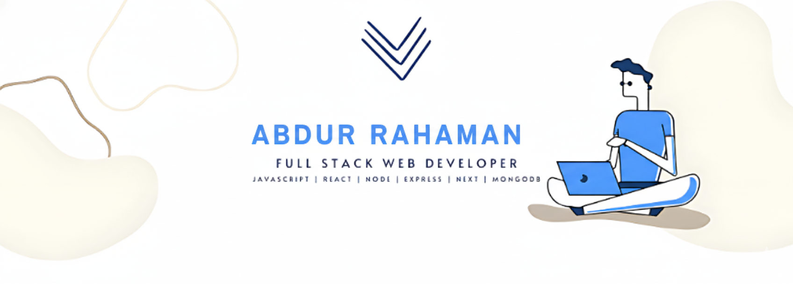

<h1 align="left">

</h1>

**Professional MERN Stack Developer | Full-Stack Web Applications with React, Next.js, Node.js, Express & MongoDB**

---

## About Me

I am a professional MERN Stack Developer with strong experience in building modern, scalable, and high-performance web applications. I specialize in React, Next.js, MongoDB, Express.js, and Node.js, and I enjoy turning complex ideas into clean, user-friendly solutions.

I have hands-on experience developing full-stack applications, REST APIs, authentication systems, dashboards, and responsive user interfaces. I focus on writing clean, maintainable code and following best practices to ensure long-term stability and performance.

I am detail-oriented, reliable, and committed to delivering quality work on time. I communicate clearly, understand client requirements carefully, and always aim to add real value to every project. Whether you need a complete MERN application, a new feature, or bug fixes, I’m here to help bring your project to life.

---

## Tech Stack

 
 
 
 
 
 
 
 

 
 
 
 

 
 

---

## Let's Connect

I’m always interested in collaborating on innovative projects and discussing new technologies. Whether you’re planning a new product, improving an existing system, or exploring collaboration, feel free to reach out.

Email: abdurrahman2009.dev@gmail.com  
Open for: Freelance Projects, Full-time Opportunities, Collaborations

---

<picture>
  <source media="(prefers-color-scheme: dark)" srcset="https://raw.githubusercontent.com/abdurrahman482937/abdurrahman482937/output/github-snake-dark.svg" />
  <source media="(prefers-color-scheme: light)" srcset="https://raw.githubusercontent.com/abdurrahman482937/abdurrahman482937/output/github-snake.svg" />
  
</picture>
